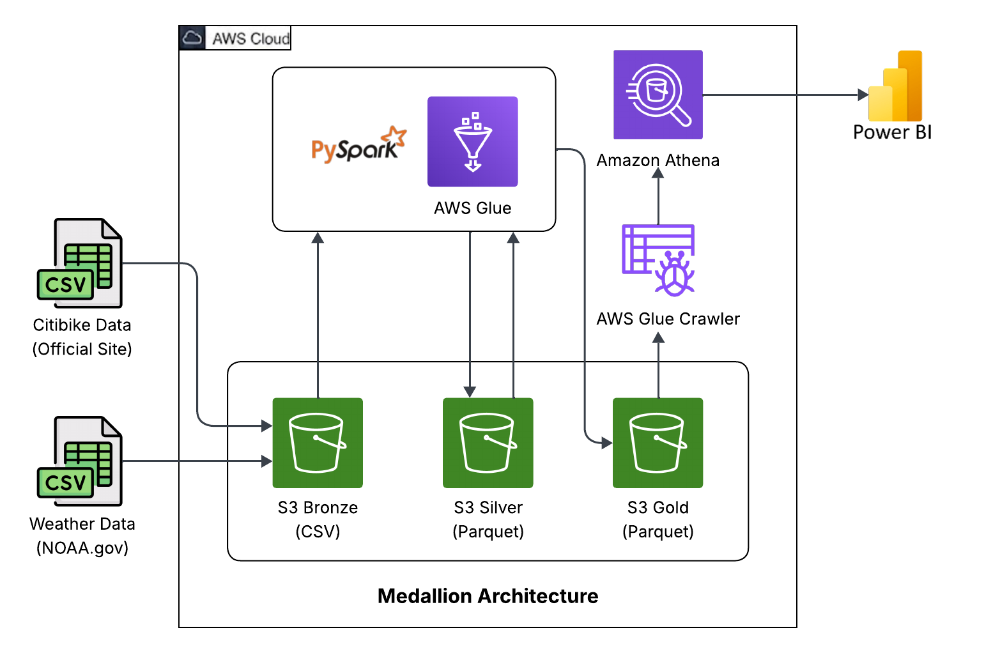
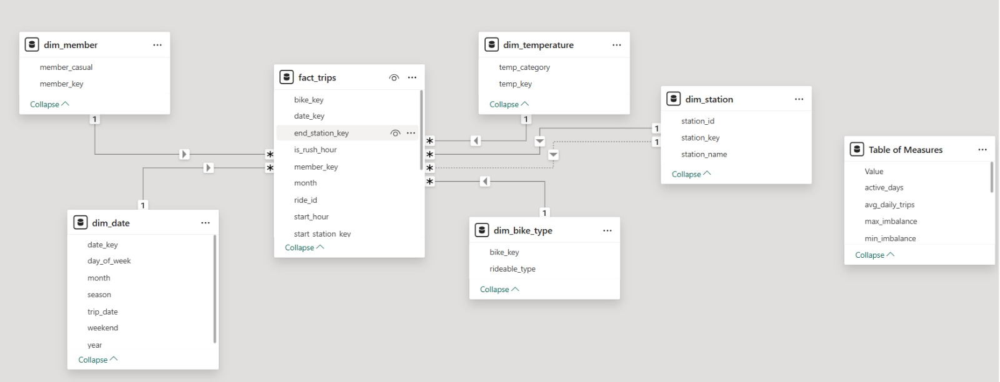

# 🚲 CitiBike Demand Optimization

An end-to-end cloud-based data analytics and visualization platform built using NYC CitiBike trip data, enriched with selected weather parameters to analyze demand patterns and usage behavior.

---

## Project Overview

The CitiBike Demand Optimization project focuses on building an end-to-end, cloud-based data analytics and visualization platform using NYC CitiBike trip data, enriched with selected weather parameters. The objective is to analyze bike usage patterns, user behavior, temporal demand trends, and operational factors, while incorporating weather conditions as an additional context to support data-driven demand optimization.

The project follows a modern serverless data architecture on AWS, leveraging distributed ETL processing, optimized storage formats, query-on-demand analytics, and BI dashboards.

---

## Services, Tools, and Technologies Used

### Cloud & Data Engineering

**Amazon S3**  
Amazon S3 is a highly scalable and durable object storage service used to store large volumes of data.  
In this project, S3 stores raw CitiBike and weather datasets and also holds cleaned, transformed, and partitioned Parquet data for analytics.

**AWS Glue**  
AWS Glue is a fully managed serverless service for large-scale data extraction, transformation, and loading.  
In this project, Glue runs PySpark jobs to clean raw data, merge datasets, perform feature engineering, and generate aggregated analytical tables.

**AWS Glue Crawler**  
AWS Glue Crawler automatically discovers data schemas and updates the AWS Glue Data Catalog.  
In this project, crawlers are used to catalog Silver and Gold layer Parquet datasets in S3, enabling seamless querying through Amazon Athena.

**Amazon Athena**  
Amazon Athena is a serverless, interactive query service that allows SQL queries directly on data stored in S3.  
In this project, Athena is used to query curated and aggregated datasets registered in the Glue Data Catalog without data movement.

**AWS IAM**  
AWS Identity and Access Management (IAM) enables secure authentication and fine-grained authorization for AWS resources.  
In this project, IAM roles and policies control access to S3, Glue jobs, Glue crawlers, Athena queries, and Power BI connectivity.

### Analytics & Visualization
- Power BI – Interactive dashboards and reporting  
- Athena ODBC Connector – Power BI integration  

### Development & DevOps
- Python (PySpark)  
- SQL  
- Git & GitHub – Version control and collaboration  
- GitHub Actions – CI/CD pipelines  
- Jira – Project timeline and task management  

---

## 1. Datasets Used

This project uses two datasets to analyze CitiBike demand and its dependency on weather conditions in New York City.

### CitiBike NYC Trip Data
- **Source:** NYC CitiBike System Data  
- **Link:** https://citibikenyc.com/system-data  
- **Description:** Ride-level data containing trip times, station details, bike type, and user category  
- **Format:** CSV (monthly historical data)

### Weather Data (NOAA)
- **Source:** NOAA – Global Summary of the Day  
- **Link:** https://www.ncei.noaa.gov/data/global-summary-of-the-day/archive/  
- **Description:** Daily weather data including temperature, precipitation, wind speed, and weather events  
- **Format:** CSV

---

## 2. Exploratory Data Analysis (EDA) – Key Findings

Based on the initial exploratory analysis, the following observations were made:

### Raw Dataset Size 
- **Raw Citibike 2024 Data Size(CSV):** 8.06 GBs
- **Raw Weather 2024 Data Size:** 57 KBs

### Merged Dataset Size(Parquet) 
- **Total Records:** 44.30 Million ride records  
- **Total Columns:** 38 columns after merging CitiBike and weather datasets  
- **File Size:** 2.46 GBs, confirming large-scale historical data  

---

### Time Coverage
- **Ride Data Period:** Covers all months from January to August 2025  
- **Weather Data Granularity:** Daily observations aligned with ride dates  
- Data shows continuous temporal coverage with no major gaps in dates  

---

### User & Bike Distribution
- **User Type:**  
  - Member users contribute the majority of rides  
  - Casual users form a smaller but significant share  
- **Bike Type:**  
  - Classic bikes dominate overall usage  
  - Electric bikes represent a smaller proportion  

---

### Trip Duration Analysis
- **Average Trip Duration:** ~10–15 minutes  
- **Majority of Trips:** Less than 30 minutes  
- **Outliers:**  
  - Very long trips (> 24 hours) detected  
  - These were treated as anomalies during transformation  

---

### Station-Level Observations
- A limited number of stations contribute to a high volume of total trips  
- Start and end station distributions indicate demand hotspots in central locations  

---

### Weather Data Observations
- **Temperature Range:** Falls within expected seasonal NYC ranges  
- **Precipitation:**  
  - Most days have low or zero precipitation  
  - Heavy precipitation events are rare  
- **Wind Speed:** Mostly low to moderate values  

---

### Weather Event Indicators
- Columns such as `FRSHTT` indicate:  
  - Rain events occur more frequently than snow or thunder  
  - Snow and thunder events are relatively rare  

---

### Data Quality Findings
- **Missing Values:**  
  - Minimal nulls in core ride fields  
  - Weather columns contain placeholder values (e.g., `999.9`) indicating missing measurements  
- **Duplicates:**  
  - Duplicate ride records were negligible  
- **Invalid Values:**  
  - Some unrealistic trip durations and distances were identified  

---

### Key EDA Conclusion
The dataset is large, well-structured, and suitable for analytics, with a small number of anomalies and missing weather values.  
EDA findings directly influenced data cleaning rules, feature engineering logic, outlier handling, and aggregation strategies used in the ETL pipeline.

---

## 3. Project Architecture

  

  <b>Figure:</b> End-to-end architecture of the CitiBike Demand Optimization pipeline

---

## 4. Data Processing Using AWS Glue (Silver Layer)

This stage processes raw CitiBike and weather data using AWS Glue (PySpark) and prepares an enriched, analytics-ready dataset.

### 4.1 Data Cleaning
- Converted timestamps, latitude, longitude, and numeric fields to correct data types  
- Removed records with invalid or missing critical values  
- Filtered trips with unrealistic durations  
- Restricted trips to valid New York City geographic boundaries  
- Handled missing and sentinel weather values  
- Raw citibike data columns: 13 and raw weather data columns: 28

---

### 4.2 Data Merging
- Integrated CitiBike trip data with daily weather data using `trip_date`  
- Retained only records with valid and usable weather observations  
- Created a unified dataset combining ride behavior with environmental conditions  
- The merged data columns: 24

---

### 4.3 Data Transformation & Feature Engineering
- Calculated trip duration and trip distance (Haversine formula)  
- Derived temporal features: day of week, month, year, season, start hour  
- Generated analytical flags: weekend, rush hour, holiday, round trip  
- Created weather event indicators (rain, snow, fog, thunder, hail)  
- Categorized temperature and precipitation into business-friendly groups  
- Final Silver data columns: 38
---

The final output is stored in Amazon S3 as Parquet files.

---

## 5. Initial Merged Data Dictionary (Pre-Transformation)

<strong>📘 Click to expand full data dictionary</strong>

| Sr No | Column Name | Description | Data Type | Sample Values |
|------:|------------|-------------|-----------|---------------|
| 1 | ride_id | A unique ID assigned to each ride | String | BF31E940F7D80958, 0DF0EDCFF6452D83 |
| 2 | rideable_type | Defines the type of bike | String | electric_bike, classic_bike |
| 3 | started_at | Start time of the ride | Datetime | 2024-07-11 08:45:00 |
| 4 | ended_at | End time of the ride | Datetime | 2024-07-11 09:05:00 |
| 5 | start_station_name | Name of the start station | String | N 6 St & Bedford Ave |
| 6 | start_station_id | Unique ID of the start station | String | 5379.1, 5869.04 |
| 7 | end_station_name | Name of the end station | String | Broadway & Berry St |
| 8 | end_station_id | Unique ID of the end station | String | 5164.05, 4824.03 |
| 9 | start_lat | Latitude of ride start | Float | 40.71745169 |
|10 | start_lng | Longitude of ride start | Float | -73.95850939 |
|11 | end_lat | Latitude of ride end | Float | 40.71036129 |
|12 | end_lng | Longitude of ride end | Float | -73.96530389 |
|13 | member_casual | Rider type (member or casual) | String | member, casual |
|14 | trip_date | Date of the ride | Date | 2024-07-11 |
|15 | station | Weather station number | String | 72505394728 |
|16 | latitude | Weather station latitude | Float | 40.77898 |
|17 | longitude | Weather station longitude | Float | -73.96925 |
|18 | elevation | Elevation above sea level (meters) | Float | 42.7 |
|19 | name | Station / airport name | String | NY CITY CENTRAL PARK |
|20 | TEMP | Mean daily temperature (°F × 0.1) | Float | 76.2 |
|21 | TEMP_ATTRIBUTES | Temp observation count | Int | 24 |
|22 | DEWP | Mean dew point temperature (°F × 0.1) | Float | 68.2 |
|23 | DEWP_ATTRIBUTES | Dew point observation count | Int | 24 |
|24 | SLP | Mean sea level pressure (mb × 0.1) | Float | 1016.1 |
|25 | SLP_ATTRIBUTES | Sea level pressure obs count | Int | 20 |
|26 | STP | Mean station pressure (mb × 0.1) | Float | 11.3 |
|27 | STP_ATTRIBUTES | Station pressure obs count | Int | 24 |
|28 | VISIB | Mean visibility (miles × 0.1) | Float | 9.3 |
|29 | VISIB_ATTRIBUTES | Visibility obs count | Int | 24 |
|30 | WDSP | Mean wind speed (knots × 0.1) | Float | 2.2 |
|31 | WDSP_ATTRIBUTES | Wind speed obs count | Int | 22 |
|32 | MXSPD | Max sustained wind speed (knots × 0.1) | Float | 5.1 |
|33 | GUST | Maximum wind gust (knots × 0.1) | Float | 999.9 |
|34 | MAX | Maximum temperature (°F × 0.1) | Float | 89.1 |
|35 | MAX_ATTRIBUTES | Max temperature obs count | Int | — |
|36 | MIN | Minimum temperature (°F × 0.1) | Float | 71.1 |
|37 | MIN_ATTRIBUTES | Min temperature obs count | Int | — |
|38 | PRCP | Total precipitation (inches × 0.01) | Float | 0.18 |
|39 | PRCP_ATTRIBUTES | Precipitation source indicator | String | G |
|40 | SNDP | Snow depth (inches × 0.1) | Float | 999.9 |
|41 | FRSHTT | Weather event flags (Fog, Rain, Snow, Hail, Thunder, Tornado) | String | 010010 |

---

## Gold Layer – Star Schema (Facts & Dimensions)

The Gold layer implements a star schema optimized for analytics and BI consumption.  
Cleaned Silver data is transformed into dimension tables and a central fact table using AWS Glue (PySpark).

### Dimensions Created
- **dim_date:** Date attributes including year, month, weekday, season, and weekend flag (partitioned by year, month)
- **dim_member:** Rider category (member / casual) with surrogate keys
- **dim_station:** Unified station dimension for both start and end stations
- **dim_bike_type:** Bike type dimension (classic / electric)
- **dim_temperature:** Temperature category dimension derived from weather data

Unknown records are handled using default surrogate keys (`-1`) to maintain referential integrity.

---

### Fact Table: fact_trips
- Stores ride-level metrics and foreign keys to all dimensions
- Includes trip distance, duration, start hour, weather, rush hour and weekend flags
- Partitioned by **year and month** to enable efficient query pruning
- Uses **snappy compression** for optimized storage and performance

---

### Design Highlights
- Surrogate keys generated using window functions for all dimensions
- Date key (`YYYYMMDD`) created once and reused across the model
- Dynamic partition overwrite enabled for safe incremental loads
- Star schema structure enables fast joins and scalable BI queries

---

This Gold layer serves as the single source for analytics, dashboards, and future advanced use cases.

---

## 7. Key Performance Indicators (KPIs) & Dashboard Charts

### KPI 1: Total Trips
Measures overall ride demand.

**Supporting Charts:**  
- Total Trips by Bike Type  
- Member vs Casual Trip Share  

### KPI 2: Average Trip Distance
Analyzes typical ride distance.

**Supporting Charts:**  
- Station Utilization Rate by Bike Type  
- Station Imbalance Analysis  

### KPI 3: Average Trip Duration
Evaluates average ride time.

**Supporting Charts:**  
- Trips by Temperature  

### KPI 4: Peak Usage Hour
Identifies busiest hour of the day.

**Supporting Charts:**  
- Total Trips by Start Hour  

### KPI 5: Rush Hour Usage Ratio
Analyzes rush hour demand.

**Supporting Charts:**  
- Rush Hour vs Non-Rush Hour Usage by User Type  

### KPI 6: Weekend Usage Ratio
Givves the usage by user type.

**Supporting Charts:**  
- Weekend Usage Distribution  

### KPI 7: Seasonal Usage Patterns
Analyzes variation in average daily trips across seasons and user types.  
Highlights seasonal demand trends and differences between member and casual riders.

**Supporting Charts:**  
- Average Daily Trips by Season and Member Type

---

## 8. Why Star Schema Pattern?

  

  <b>Figure:</b> Star-Schema Based Data Model

## 8. Why We Used a Star Schema

The data model was designed using a star schema to achieve high performance, scalability, and analytical clarity for large, time-series CitiBike data. With a single central fact table and well-defined dimensions, the star schema enables fast queries, accurate aggregations, and intuitive analysis in Power BI.

### Key Reasons

- **Analytics-Focused Use Case:**  
  The project is built for analysis and decision-making (trip trends, user behavior, weather impact), not transactional updates, making star schema ideal for OLAP workloads.

- **Natural Data Fit:**  
  A central `fact_trips` table with dimensions such as date, station, member type, bike type, and temperature aligns naturally with the problem domain.

- **Performance Optimization:**  
  Star schema reduces join complexity, improves columnar compression, and enables faster query execution and DAX evaluation, directly improving dashboard performance.

- **Clean & Accurate Analytics:**  
  Eliminates many-to-many relationships and ambiguous filter paths, ensuring correct totals, no double counting, and predictable filter behavior.

- **Ease of Visualization & Collaboration:**  
  Simple structure makes the model easy to understand, reduces errors, and accelerates dashboard development.

Overall, the star schema provides a robust, scalable foundation for high-performance analytics and BI reporting.

---

## 9. Infrastructure as Code (Terraform) & CI/CD

### Infrastructure as Code (Terraform)
- Terraform manages AWS infrastructure including S3 buckets, IAM roles, Glue jobs, workflows, and crawlers  
- Infrastructure changes are applied automatically based on updates to Terraform code, ensuring consistency and repeatability  

### CI/CD Pipeline (GitHub Actions)
- Separate pipelines are implemented for Terraform infrastructure and Glue ETL scripts  
- Path-based triggers ensure independent execution for infrastructure changes and ETL code updates  
- Glue scripts are validated, deployed to Amazon S3, and Glue workflows are triggered safely  
- Manual pipeline triggers are supported for controlled infrastructure deployments  

Together, Terraform and CI/CD provide a **fully automated, reliable, and production-aligned data pipeline**.

---